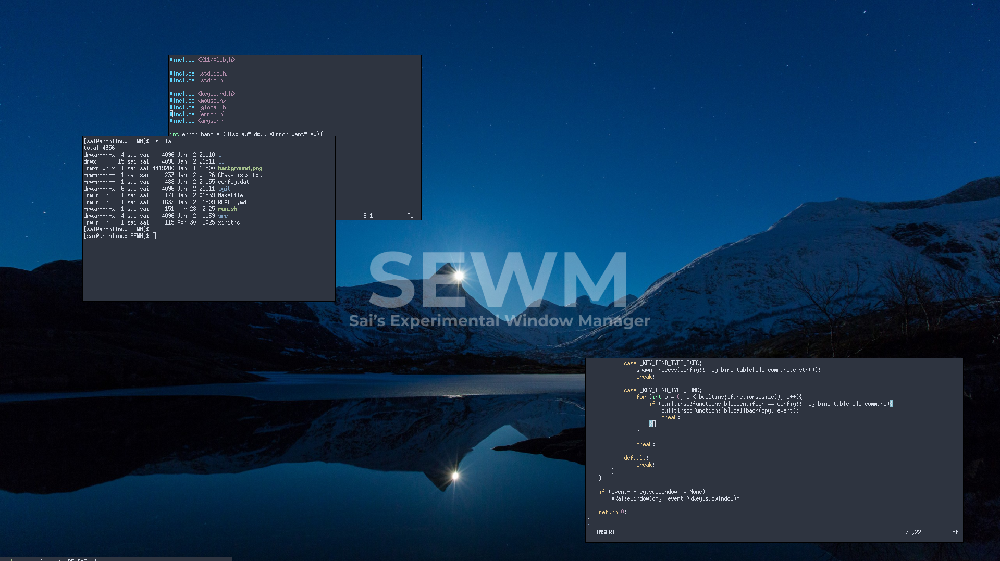

## SEWM (Sai's Experimental Window Manager)
***Sweet, Simple, and Unstable***

## Introduction
SEWM is a simple window manager written in c++ for X11. It doesn't currently do much aside from the basic functions you would expect from such a software, but it is a start.

**Note**\
As much as the tagline says unstable, I have not experienced any crashes or major bugs. That being said if you do, please feel free to open an issue and I will try to resolve it. (Not that I plan on anyone actually using this)

\
**Example of SEWM running with a few xterms open**

### Will it support tiling?
Not sure, maybe? There are plenty of tiling window managers out there so one more wouldn't make the earth turn any faster. Though I do quite like BSPWM so perhaps I might add an optional tiling mode.

### Why X11 in current year?
To put it simply, because I know XLib. I have absolute no clue how wayland works, and to be honest, I don't have much on an interest in learning for what is just a pet project.

### Can you configure it?
Absolutely, to a point at least, you can consult the default config.dat file to see everything you can do to configure the window manager.

### Is it usable?
Of course it is, as with all my project I made it for myself, and I use it daily. Using it constantly is the only way to know what needs adding to make it more comfortable and to find bugs.

### What is the end goal?
The end goal is simple:
 - make a window manager that suits me.
 - Ideally make it super easy to configure and customise.
 - Try make it as resource friendly as I can.

## Build & Run
### Dependencies
 - You will need the XLib development library to build
 - Xephyr if you want to run it in a window for testing

### Building
To build the project all you have to do is run `make`

### Running
You can either run it in a test environment with `./run.sh`

Or you can run it fully with `startx ./xinitrc`
